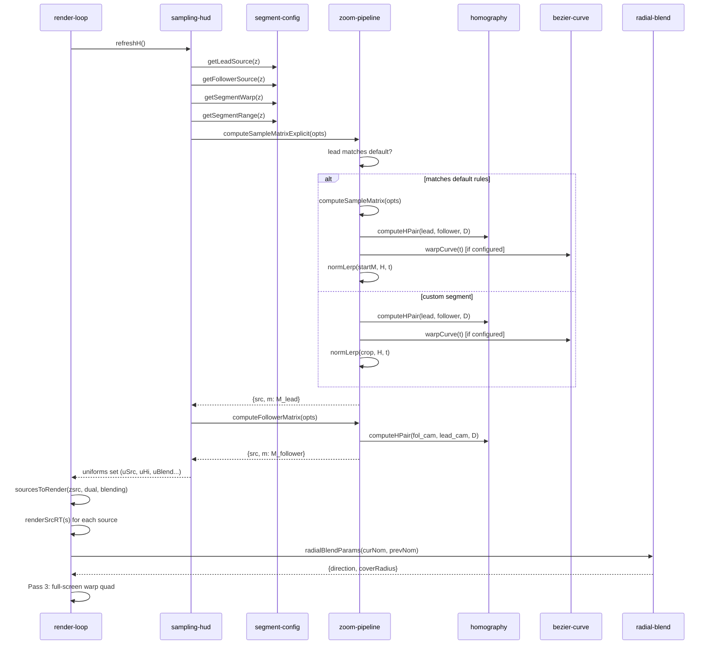
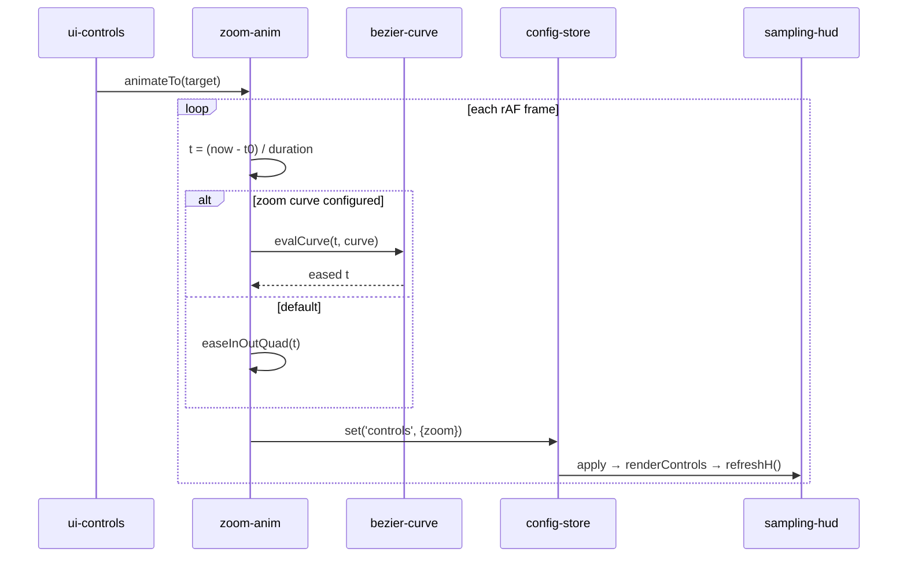
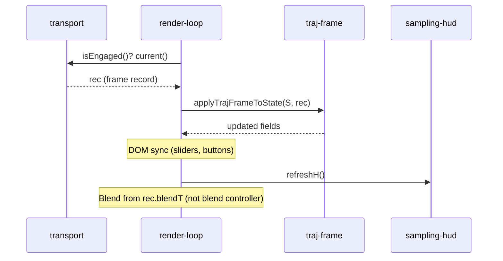
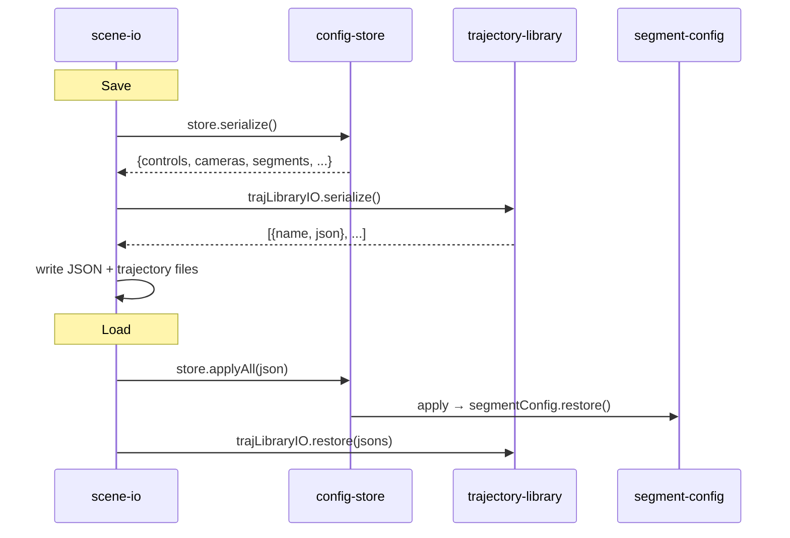

# VectorScope Module Map

Overview of all modules, their dependencies, exported functions, and
inter-module relationships.

---

## 1. Module Dependency Graph

```mermaid
graph TD
    subgraph "Pure Math (zero dependencies)"
        math["math.js<br/>3×3 matrix ops"]
        camera["camera.js<br/>DEF_CAM, SCENE_CAM"]
        blend["blend.js<br/>createBlendController"]
        transport["transport.js<br/>createTransport"]
        trajectory["trajectory.js<br/>parseTrajectory"]
        configStore["config-store.js<br/>createConfigStore"]
        helpReg["help-registry.js<br/>createHelpRegistry"]
        sceneAnim["scene-anim.js<br/>createSceneAnimator"]
        trajFrame["traj-frame.js<br/>applyTrajFrameToState"]
        radialBlend["radial-blend.js<br/>radialBlendParams"]
        trajLib["trajectory-library.js<br/>createTrajectoryLibrary,<br/>trajToJson"]
    end

    subgraph "Homography Pipeline"
        homography["homography.js<br/>computeHPair, zoomMatrix"]
        zoomPipeline["zoom-pipeline.js<br/>computeSampleMatrix,<br/>zoomSource, followerSource,<br/>computeFollowerMatrix"]
        cameraSampling["camera-sampling.js<br/>cameraNominal, cameraCrop,<br/>cameraSampleMatrix"]
        segConfig["segment-config.js<br/>createSegmentConfig"]
    end

    subgraph "Curve System"
        bezierCurve["bezier-curve.js<br/>evalCurve, sampleCurve"]
        curveEditor["curve-editor.js<br/>createCurveEditor"]
        zoomAnim["zoom-anim.js<br/>createZoomAnimator"]
    end

    subgraph "Segment UI"
        segDialog["segment-dialog.js<br/>bindSegmentDialog"]
    end

    subgraph "Rendering (DOM/GL)"
        shader["shader.js<br/>GLSL warp shader"]
        glBootstrap["gl-bootstrap.js<br/>createGlContext"]
        renderLoop["render-loop.js<br/>createRenderLoop"]
        samplingHud["sampling-hud.js<br/>createSamplingRefresh"]
    end

    subgraph "Scene Management"
        loader["loader.js<br/>loadScene, initLoader"]
        assetReg["asset-registry.js<br/>createAssetRegistry"]
        assetParse["asset-parse.js<br/>createAssetParser"]
        sceneIO["scene-io.js<br/>createSceneIO"]
        sceneMgr["scene-manager.js<br/>createSceneManager"]
        fallback["fallback-scene.js<br/>createFallbackScene"]
    end

    subgraph "Interaction (DOM)"
        panels["panels.js<br/>createPanelManager"]
        interaction["interaction.js<br/>initInteraction"]
        selPanel["selection-panel.js<br/>initSelectionPanel"]
        uiControls["ui-controls.js<br/>initUiControls"]
        camDialog["camera-dialog.js<br/>renderCamDialog"]
        autofocus["autofocus.js<br/>initAutofocus"]
        cameraRig["camera-rig.js<br/>createCameraRig"]
        bevGhost["bev-ghost.js<br/>createBevGhost"]
        objectOps["object-ops.js<br/>createObjectOps"]
        recorder["recorder.js<br/>createRecorder"]
    end

    %% Homography pipeline dependencies
    homography --> math
    zoomPipeline --> math
    zoomPipeline --> homography
    cameraSampling --> zoomPipeline
    cameraSampling --> homography
    cameraSampling --> math
    segConfig --> zoomPipeline

    %% Curve system dependencies
    curveEditor --> bezierCurve
    zoomAnim --> zoomPipeline
    zoomAnim --> bezierCurve

    %% Segment dialog
    segDialog --> zoomPipeline
    segDialog --> segConfig

    %% Rendering
    glBootstrap --> shader
    renderLoop --> zoomPipeline
    renderLoop --> radialBlend
    samplingHud --> zoomPipeline
    samplingHud --> math

    %% Scene
    sceneIO --> trajectory

    %% Interaction
    uiControls --> zoomAnim
    uiControls --> camDialog
    uiControls --> zoomPipeline
    recorder --> trajectory
    recorder --> zoomPipeline

    %% Orchestrator
    indexHTML["index.html<br/>(orchestrator)"]
    indexHTML --> zoomPipeline
    indexHTML --> blend
    indexHTML --> sceneAnim
    indexHTML --> cameraRig
    indexHTML --> bevGhost
    indexHTML --> fallback
    indexHTML --> loader
    indexHTML --> assetReg
    indexHTML --> objectOps
    indexHTML --> assetParse
    indexHTML --> sceneIO
    indexHTML --> panels
    indexHTML --> interaction
    indexHTML --> selPanel
    indexHTML --> autofocus
    indexHTML --> glBootstrap
    indexHTML --> renderLoop
    indexHTML --> samplingHud
    indexHTML --> uiControls
    indexHTML --> sceneMgr
    indexHTML --> configStore
    indexHTML --> trajectory
    indexHTML --> transport
    indexHTML --> recorder
    indexHTML --> segConfig
    indexHTML --> segDialog
    indexHTML --> bezierCurve
    indexHTML --> curveEditor
    indexHTML --> trajLib
    indexHTML --> trajFrame
    indexHTML --> camera

    style math fill:#1a3a1a,stroke:#4caf50
    style homography fill:#1a3a1a,stroke:#4caf50
    style zoomPipeline fill:#1a3a1a,stroke:#4caf50
    style cameraSampling fill:#1a3a1a,stroke:#4caf50
    style bezierCurve fill:#1a3a1a,stroke:#4caf50
    style segConfig fill:#1a3a1a,stroke:#4caf50
    style blend fill:#1a3a1a,stroke:#4caf50
    style radialBlend fill:#1a3a1a,stroke:#4caf50
    style trajLib fill:#1a3a1a,stroke:#4caf50
    style trajFrame fill:#1a3a1a,stroke:#4caf50
    style configStore fill:#1a3a1a,stroke:#4caf50
    style helpReg fill:#1a3a1a,stroke:#4caf50
    style trajectory fill:#1a3a1a,stroke:#4caf50
    style transport fill:#1a3a1a,stroke:#4caf50
    style sceneAnim fill:#1a3a1a,stroke:#4caf50
    style camera fill:#1a3a1a,stroke:#4caf50
    style indexHTML fill:#3a1a1a,stroke:#e94560
```

Green nodes = pure modules (no DOM/GL). Red node = orchestrator (index.html).

---

## 2. Function Call Flow

### 2.1 Sampling Pipeline (per-frame)

### 2.2 Zoom Transition (Go button click)

### 2.3 Trajectory Playback

### 2.4 Scene Save/Load

---

## 3. Module Inventory

### Pure Modules (no DOM, fully testable)

| Module | Lines | Exports | Purpose |
|--------|------:|--------:|---------|
| `math.js` | 137 | 1 | 3×3 matrix operations (mul, inv, transpose, det, etc.) |
| `homography.js` | 153 | 4 | Plane-induced homography, zoomMatrix, eulerR |
| `zoom-pipeline.js` | 302 | 11 | 4-segment zoom pipeline, warp interpolation, lead/follower matrices |
| `camera-sampling.js` | 114 | 5 | Per-camera nominal, crop, sample matrix (warp-off path) |
| `segment-config.js` | 208 | 9 | Breakpoint-based segment → lead/follower/warp config |
| `bezier-curve.js` | 136 | 7 | Cubic bezier evaluation, curve sampling |
| `blend.js` | 83 | 1 | Camera-transition blend state machine |
| `radial-blend.js` | 38 | 1 | Radial blend direction + coverage radius |
| `trajectory.js` | 156 | 5 | Trajectory parser (delta expansion, blend injection) |
| `trajectory-library.js` | 101 | 2 | Trajectory storage + delta-encode serialization |
| `traj-frame.js` | 83 | 3 | Pure state mapping: traj record → app state S |
| `transport.js` | 149 | 1 | Play/Pause/Stop/Seek state machine + master clock |
| `recorder.js` | 137 | 1 | Per-frame state capture for trajectory recording |
| `camera.js` | 64 | 2 | Default camera params + scene camera constants |
| `config-store.js` | 128 | 1 | Central config store (register/set/serialize/applyAll) |
| `help-registry.js` | 67 | 2 | Distributed help system (collect + render) |
| `scene-anim.js` | 202 | 5 | Object animation engine (spin, bob, orbit, float) |
| `zoom-anim.js` | 98 | 1 | Zoom preset transitions + Play bounce loop |
| `shader.js` | 163 | 3 | GLSL vertex + fragment shaders (warp + blend) |

### DOM/GL Modules

| Module | Lines | Exports | Purpose |
|--------|------:|--------:|---------|
| `render-loop.js` | 377 | 6 | Frame pacing, RT rendering, blend uniforms, BEV |
| `sampling-hud.js` | 129 | 2 | Pipeline math → shader uniforms + HUD display |
| `ui-controls.js` | 233 | 3 | Control panel widgets ↔ config store |
| `panels.js` | 247 | 2 | Layout manager (5 panels + labels + separators) |
| `interaction.js` | 224 | 2 | Mouse/pointer handlers (drag, select, orbit) |
| `selection-panel.js` | 274 | 3 | Object info panel (position, depth, rotation, anim) |
| `camera-dialog.js` | 176 | 4 | Camera params edit dialog |
| `segment-dialog.js` | 196 | 2 | Segment config dialog (breakpoints + lead/follower/warp) |
| `curve-editor.js` | 233 | 1 | Canvas bezier curve editor |
| `autofocus.js` | 220 | 2 | Tap-to-focus (depth pass + median sampling) |
| `gl-bootstrap.js` | 80 | 1 | WebGL context, render targets, materials |
| `camera-rig.js` | 193 | 1 | Three.js camera instances from intrinsics/extrinsics |
| `bev-ghost.js` | 69 | 2 | BEV ghost transparency for tall objects |
| `loader.js` | 260 | 9 | GLTF/OBJ model loader |
| `scene-io.js` | 232 | 6 | Scene save/load (JSON + trajectory files) |
| `scene-manager.js` | 59 | 1 | Scene load orchestration + fallback timer |
| `fallback-scene.js` | 72 | 1 | Default primitives when no model loaded |
| `asset-registry.js` | 81 | 1 | Drag-and-drop asset catalog |
| `asset-parse.js` | 121 | 3 | GLTF/OBJ/image file parser |
| `object-ops.js` | 212 | 2 | Object add/delete/duplicate/hide operations |

### Orchestrator

| File | Lines | Role |
|------|------:|------|
| `index.html` | 1180 | HTML layout + CSS + JS wiring (imports all modules, creates instances, binds DOM events) |

---

## 4. Test Coverage

| Test file | Tests | Covers |
|-----------|------:|--------|
| `math.test.js` | — | Matrix ops |
| `homography.test.js` | — | computeH, computeHPair, zoomMatrix |
| `zoom-pipeline.test.js` | 36 | All segment logic, lead/follower, segRange warp |
| `camera-sampling.test.js` | 17 | cameraNominal, cameraCrop, cameraSampleMatrix |
| `segment-config.test.js` | 26 | Breakpoints, assignments, per-segment warp |
| `bezier-curve.test.js` | 18 | bezierAt, solveBezierT, evalCurve, sampleCurve |
| `blend.test.js` | — | Blend controller state machine |
| `radial-blend.test.js` | 7 | radialBlendParams |
| `trajectory-library.test.js` | 13 | trajToJson, createTrajectoryLibrary |
| `traj-frame.test.js` | 12 | applyTrajFrameToState, TRAJ_LOCK_IDS |
| `render-loop.test.js` | — | sourcesToRender, blendFeed, frameGate, paceDue |
| `sampling-hud.test.js` | 7 | formatHMatrix, refreshH |
| `recorder.test.js` | 7 | Recorder capture/start/stop |
| `config-store.test.js` | — | Config store register/set/serialize |
| `scene-io.test.js` | 4 | Scene save/load |
| `camera.test.js` | 7 | Camera constants |
| `shader.test.js` | 11 | GLSL source structure |
| ... | ... | ... |
| **Total** | **334** | |
